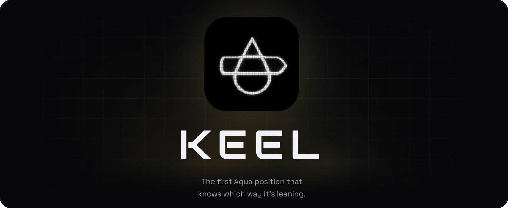
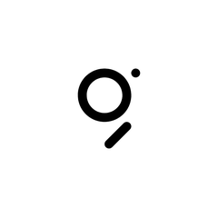

<p align="center">
  
</p>

<h1 align="center">Keel</h1>

<p align="center"><strong>The first Aqua position that knows which way it's leaning.</strong></p>

<p align="center">ETHOnline 2026 &nbsp;·&nbsp; 1inch &nbsp;·&nbsp; The Graph &nbsp;·&nbsp; Uniswap Foundation</p>

---

Every market maker's real enemy is inventory risk, not spread. Quote symmetrically around mid and a trending market grinds you into holding more and more of the depreciating side — you earn spread on every fill and lose money on the position. Every professional desk solves this with a *reservation price* (Avellaneda & Stoikov, 2008): skew quotes away from mid as inventory drifts from target. **No on-chain venue has ever implemented this**, because on a pool AMM the inventory belongs to the pool, not to any one maker — there's nothing for a reservation-price formula to skew around.

Aqua is the first venue where this is possible. Tokens never leave the maker's wallet; `aqua.safeBalances(maker, app, strategyHash, tokenIn, tokenOut)` reads a maker's *real, live wallet inventory* at quote time — a number no pool AMM design exposes. Keel is a custom SwapVM instruction that reads that number, computes a reservation price skewed away from mid in proportion to inventory imbalance, and quotes around it instead of raw mid. As inventory drifts, the position's own bid/ask separation widens on the exposed side and tightens on the covered side — it defends itself without a keeper.

The same pricing kernel also runs as a Uniswap v4 dynamic-fee hook — one kernel, two venues.

---

## Live deployments

**Base Sepolia** (chain 84532):

| Contract | Address |
|---|---|
| Aqua | [`0xAf5Bb8e83F3d22Ec349dB641E0Bd7edA5d9574CD`](https://sepolia.basescan.org/address/0xAf5Bb8e83F3d22Ec349dB641E0Bd7edA5d9574CD) |
| KeelRouter | [`0xeE6bb570BcfD4Ff2F168F4E0b492C7a5282b14dA`](https://sepolia.basescan.org/address/0xeE6bb570BcfD4Ff2F168F4E0b492C7a5282b14dA) — keys `KeelInventorySkew`'s decimals to tokenA/tokenB rather than to the swap's in/out sides, which is what makes covered-side (B→A) fills price and settle correctly |
| KeelSkewHook | [`0x52EBAdE332113825827b4Ad2Dc55B1743E9A40C0`](https://sepolia.basescan.org/address/0x52EBAdE332113825827b4Ad2Dc55B1743E9A40C0) (against Base Sepolia's real, already-deployed v4 `PoolManager`) |
| Subgraph | [thegraph.com/studio/subgraph/keel-subgraph](https://thegraph.com/studio/subgraph/keel-subgraph) |
| KeelDemoTaker | [`0x54A8d52E72C0FdfB3ECF7014F47cE24D6229B763`](https://sepolia.basescan.org/address/0x54A8d52E72C0FdfB3ECF7014F47cE24D6229B763) — quote/fill helper for the browser console |
| Pair | [`WETH`](https://sepolia.basescan.org/address/0x4200000000000000000000000000000000000006) / [`USDC`](https://sepolia.basescan.org/address/0x036CbD53842c5426634e7929541eC2318f3dCF7e) — real tokens, not mocks; WETH funds via `deposit()`, USDC via [Circle's faucet](https://faucet.circle.com) |

**Ethereum Sepolia** (chain 11155111) and **Arbitrum Sepolia** (chain 421614), same `KeelInstructions` build as Base Sepolia's current router:

| Contract | Ethereum Sepolia | Arbitrum Sepolia |
|---|---|---|
| Aqua | [`0x20592B28…669cE`](https://sepolia.etherscan.io/address/0x20592B28fCaa6ADa4097bDB03f31d76bE13669cE) | [`0x2dDc814a…8b1b3`](https://sepolia.arbiscan.io/address/0x2dDc814a107e8F982f356E3b409DC2D00F68b1b3) |
| KeelRouter | [`0x2854Fa99…16fBb`](https://sepolia.etherscan.io/address/0x2854Fa991680bd7bBfC660D197B883e025C16fBb) | [`0x2e8697Ef…3B744`](https://sepolia.arbiscan.io/address/0x2e8697EfCe447002d0056445645932020023B744) |
| KeelDemoTaker | [`0x9d8219a0…a6a`](https://sepolia.etherscan.io/address/0x9d8219a05C14a5232502da77F93227615b750a6a) | [`0x6559F59d…Ab8`](https://sepolia.arbiscan.io/address/0x6559F59dC0Bc3Fa80B2E33B1957D30ed17507Ab8) |
| Pair | WETH `0xfFf99767…4d6B14` / USDC `0x1c7D4B19…9C7238` | WETH `0x980B62Da…af17c73` / USDC `0x75faf114…E46AA4d` |

These two chains have Aqua + KeelRouter + KeelDemoTaker deployed but no shipped position yet — the console currently drives Base Sepolia only ([`apps/console/lib/chain.ts`](apps/console/lib/chain.ts)); pointing it at either of these is a config change, not a contract one.

---

## The on-chain run

**A real Keel position has been shipped and filled against Base Sepolia**, on the real Circle USDC / WETH pair — no mock tokens — via [`contracts/script/ShipKeelRealPair.s.sol`](contracts/script/ShipKeelRealPair.s.sol): ten exposed-side fills that each lean the position further out, then **one covered-side fill** bringing it back (0.0001 WETH in for 3.372388 USDC out, [block 46736201](https://sepolia.basescan.org/tx/0xc135c35b900889d9f56afeb76345aee640e1b8a86afa5d36631896a8dc2055ae)). That covered fill is the first this project has landed: on the previous router the direction was mispriced and reverted at any realistic size. [Ship tx](https://sepolia.basescan.org/tx/0xf6e5a89e9477b3371c222a8e5cdd3abebfa256100e9d83fed495b4c34003e498) · strategy hash `0x912d8904fb6690e3137048d86eb1a570b765620a412edd6f9f3dbe83b036d8b0`.

Every value is checked in at [`apps/console/data/onchain-demo.json`](apps/console/data/onchain-demo.json) and rendered on `/simulate` and `/mechanism`, so the evidence survives an unreachable RPC or subgraph during a demo. It was decoded from the router's own fill events rather than copied from forge's broadcast log — that log prints the *simulation* pass, whose amounts differ slightly from what settled; summing the decoded events reproduces `aqua.safeBalances()` exactly, which is what makes the file trustworthy (see its `verificationNote`).

---

## Sponsor integrations

Each claim below points at the specific file and line that backs it, or at a public address that can be inspected on a block explorer.


### 1inch — Aqua / SwapVM

The mechanism *is* a SwapVM instruction, not an application layered on top of one.

| Requirement | Evidence |
|---|---|
| Official Aqua / SwapVM contracts used, unmodified | `contracts/lib/swap-vm` and `contracts/lib/aqua` are cloned verbatim from 1inch's own repositories (see [Setup](#setup)) and are not vendored or patched — only code authored here is tracked in this repo |
| Built as a real SwapVM opcode | [`KeelInstructions.sol#L54`](contracts/src/instructions/KeelInstructions.sol#L54) — `OPCODE = 0x92`, a reserved-but-unallocated slot in the balance-tuning family bank |
| Extends the real router rather than replacing it | [`KeelRouter.sol#L26`](contracts/src/routers/KeelRouter.sol#L26) inherits the real `AquaSwapVMRouter`; [`#L31`](contracts/src/routers/KeelRouter.sol#L31) overrides `_runOpcode` to intercept `0x92`, and [`#L35`](contracts/src/routers/KeelRouter.sol#L35) delegates every other opcode to `super._runOpcode`, the stock dispatcher |
| Append-only property is tested, not asserted | [`contracts/test/KeelRouter.t.sol`](contracts/test/KeelRouter.t.sol) proves it against the real router |
| Reads live maker inventory through Aqua | `AQUA.safeBalances()` populates `ctx.swap.balanceIn/balanceOut` before any opcode runs — [`KeelInstructions.sol#L157`](contracts/src/instructions/KeelInstructions.sol#L157) |
| On-chain execution of token transfers, demonstrable at demo | KeelRouter is live on Base Sepolia (address above) with a shipped position, ten exposed-side fills and one covered-side fill already settled — see [The on-chain run](#the-on-chain-run) |
| Feedback | [`FEEDBACK/1INCH.md`](FEEDBACK/1INCH.md) |



### The Graph — Subgraph and Subgraph MCP

Two Graph products composed: a subgraph that reconstructs pricing state, and the official Subgraph MCP endpoint that exposes it to agents.

| Requirement | Evidence |
|---|---|
| Compose two or more Graph products | A deployed subgraph ([`subgraph/`](subgraph/)) plus The Graph's official Subgraph MCP endpoint, wired at [`subgraph/mcp/mcp.config.json#L5`](subgraph/mcp/mcp.config.json#L5) (`https://subgraphs.mcp.thegraph.com/sse`) |
| Consumes live chain data, not mocked or static | [`subgraph/subgraph.yaml`](subgraph/subgraph.yaml) indexes Base Sepolia directly — Aqua, and the current KeelRouter from block 46735212 ([`#L99`](subgraph/subgraph.yaml#L99)). Earlier router deployments remain in the manifest solely so their historical fills are not orphaned; nothing new is shipped against them |
| Deployed and healthy | Deployment `QmRFBHuUtSAgDkrLhCe5Ae2cn1Nwp2sqKfeMVvBD5fvZog`, `hasIndexingErrors: false`, synced past block 46766997, holding 21 positions and 88 fills — from its own `_meta` query |
| Indexes the current deployment, verifiably | Querying strategy `0x912d8904…` returns `keelRouter: 0xeE6bb570…`, the current router, with all 11 fills: ten exposed-side, then the covered fill at block 46736201 reading `amountIn` 100000000000000 / `amountOut` 3372388 — the same 0.0001 WETH for 3.372388 USDC stated above, reconstructed independently from events rather than copied |
| Indexes real protocol state | [`mapping.ts#L72`](subgraph/src/mapping.ts#L72) `handleShipped` decodes Aqua's `Shipped` payload and locates the `InventorySkew` opcode inside it; [`#L165`](subgraph/src/mapping.ts#L165) / [`#L182`](subgraph/src/mapping.ts#L182) `handlePushed` / `handlePulled` track real balances (without them the indexed values were deltas since ship, and could read negative); [`#L247`](subgraph/src/mapping.ts#L247) `handleSwapped` records each fill |
| Solves a real problem for consumers of the data | The Avellaneda-Stoikov formula the contract runs is ported to AssemblyScript and re-run in the mapping, so a solver querying the subgraph gets the same reservation price a live `quote()` call would — see [Subgraph](#subgraph--the-routability-problem-solved) |
| Feedback | [`FEEDBACK/THEGRAPH.md`](FEEDBACK/THEGRAPH.md) |


### Uniswap — v4 dynamic-fee hook

The same pricing kernel, deployed against Base Sepolia's real, already-deployed v4 `PoolManager`.

| Requirement | Evidence |
|---|---|
| Public repository | [github.com/Khalid-000-ME/keel](https://github.com/Khalid-000-ME/keel) |
| README points at the relevant contracts and lines | [`KeelSkewHook.sol#L122`](contracts/src/uniswap/KeelSkewHook.sol#L122) `_beforeSwap`; [`#L153`](contracts/src/uniswap/KeelSkewHook.sol#L153) `_computeFeeBps`, the actual skew logic; [`#L133`](contracts/src/uniswap/KeelSkewHook.sol#L133) returns the fee override with `LPFeeLibrary.OVERRIDE_FEE_FLAG` |
| Uses the correct v4 extension point | The dynamic-fee override returned from `beforeSwap`, found by reading [`LPFeeLibrary.sol`](contracts/src/uniswap/KeelSkewHook.sol#L7) directly rather than assuming an interface |
| Shares the kernel with the Aqua opcode | `halfSpreadWad` ([`AvellanedaStoikov.sol#L58`](contracts/src/libs/AvellanedaStoikov.sol#L58)) and `softBoundPenaltyBps` ([`#L68`](contracts/src/libs/AvellanedaStoikov.sol#L68)) are reused verbatim; the curve-reshaping functions are not, and the reason is stated in [Architecture](#architecture--design-decisions-from-reading-the-real-source) rather than hidden |
| Deployed and tested | Live at [`0x52EBAdE3…A40C0`](https://sepolia.basescan.org/address/0x52EBAdE332113825827b4Ad2Dc55B1743E9A40C0); 5 end-to-end tests in [`contracts/test/KeelSkewHook.t.sol`](contracts/test/KeelSkewHook.t.sol) |
| `FEEDBACK.md` and feedback form | [`FEEDBACK/UNISWAP.md`](FEEDBACK/UNISWAP.md); the form submission itself is a manual step outside this repo |

---

## What's built

| Layer | Where | Status |
|---|---|---|
| Pricing kernel | [`contracts/src/libs/AvellanedaStoikov.sol`](contracts/src/libs/AvellanedaStoikov.sol) | Built, 8 fuzz properties × 2000 runs |
| SwapVM opcode | [`contracts/src/instructions/KeelInstructions.sol`](contracts/src/instructions/KeelInstructions.sol) | Built, real opcode `0x92` on real SwapVM |
| Aqua router | [`contracts/src/routers/KeelRouter.sol`](contracts/src/routers/KeelRouter.sol) | Live on Base Sepolia |
| Quote/swap parity | [`contracts/test/QuoteSwapParity.t.sol`](contracts/test/QuoteSwapParity.t.sol) | 2000 fuzz runs + boundary cases, passing |
| Uniswap v4 hook | [`contracts/src/uniswap/KeelSkewHook.sol`](contracts/src/uniswap/KeelSkewHook.sol) | Live on Base Sepolia, against the real deployed `PoolManager` |
| Adversarial simulation | [`contracts/script/AdversarialFlow.s.sol`](contracts/script/AdversarialFlow.s.sol) | Built, produces the receipt below from a real run |
| Real position, real fills | [`contracts/script/ShipKeelRealPair.s.sol`](contracts/script/ShipKeelRealPair.s.sol) | Live on Base Sepolia — 10 exposed-side fills plus the first covered-side fill, decoded from events and checked in |
| Off-chain SDK | [`packages/strategy-sdk`](packages/strategy-sdk) | Built, byte-verified against live Solidity fixtures |
| Subgraph | [`subgraph/`](subgraph/) | Deployed, indexing Base Sepolia |
| Maker console | [`apps/console/app/strategies`](apps/console/app/strategies) | Live — connect a wallet and ship a real position from the browser |
| Market page | [`apps/console/app/market`](apps/console/app/market) | Live — every live strategy's quote curve overlaid, swap routes to the best real `previewFill` |
| Demo kit | [`contracts/src/demo/`](contracts/src/demo/) | Live on Base Sepolia — faucet tokens and the taker helper the console drives |

**38 Foundry tests and 5 SDK tests, all passing** (`forge test`; `pnpm --filter @keel/strategy-sdk test`):

| Suite | Tests |
|---|---|
| `AvellanedaStoikovTest` | 8 |
| `KeelDemoKitTest` | 7 |
| `KeelInventorySkewDecimalsTest` | 6 |
| `EncodingFixturesTest` | 5 |
| `KeelSkewHookTest` | 5 |
| `QuoteSwapParityTest` | 4 |
| `KeelRouterTest` | 3 |

---

## The receipt

Generated from a real run of [`contracts/script/AdversarialFlow.s.sol`](contracts/script/AdversarialFlow.s.sol) piped through [`packages/sim-report`](packages/sim-report) — not hand-typed:

> Over 120 fills on a trending series (mid moved from 0.0002857142 to 0.0000834811, -70.78%), both positions took on the identical inventory drift (token0 grew 84.39% for both, since both received the same fixed-size adversarial fills), but the stock position ended -0.2110 PnL while Keel ended -0.0620 PnL — a 0.1490 improvement, entirely from Keel's reservation-price skew pricing the exposed-side fills worse for the taker as inventory drifted.

Both positions face the *exact same* adversarial flow and end up holding the *exact same* inventory — the divergence is entirely in what each fill cost, because Keel's reservation price moved against the taker as inventory drifted and the stock constant-product curve's didn't. Reproduce it:

```bash
cd contracts
forge script script/AdversarialFlow.s.sol --tc AdversarialFlow > /tmp/sim-output.log
cd ..
pnpm --filter @keel/sim-report start /tmp/sim-output.log apps/console/data
```

The pinned seed and series parameters — 120 ticks, fixed fill size, fixed γ/σ²/spread/bound — are stated directly in `AdversarialFlow.s.sol`, next to where they're used, so the numbers are reproducible run to run. The pair is USDC/WETH-shaped: 6 decimals on one side, 18 on the other, starting near a realistic ~1/3500 mid, so the run actually exercises `KeelInventorySkew`'s decimals normalization — the earlier version used two 18-decimal mocks at a mid of exactly 1.0, where that code path was unreachable.

---

## Repository structure

```
keel/
├─ contracts/
│  ├─ lib/                  # swap-vm, aqua, v4-core, v4-periphery -- gitignored, see Setup
│  ├─ src/
│  │  ├─ libs/AvellanedaStoikov.sol        # the pricing kernel, pure functions
│  │  ├─ instructions/KeelInstructions.sol # KeelInventorySkew, the SwapVM opcode
│  │  ├─ routers/KeelRouter.sol            # append-only over AquaSwapVMRouter
│  │  ├─ uniswap/KeelSkewHook.sol          # same kernel, v4 dynamic-fee hook
│  │  └─ demo/                             # faucet token + taker helper, browser console only
│  ├─ test/                 # AvellanedaStoikov, KeelRouter, QuoteSwapParity, KeelSkewHook, EncodingFixtures, KeelDemoKit, KeelInventorySkewDecimals
│  └─ script/               # AdversarialFlow (the receipt), ShipKeelRealPair, deploys
├─ packages/
│  ├─ seam/                 # shared TS types mirroring the Solidity structs
│  ├─ strategy-sdk/         # ship/dock calldata, byte-verified against Solidity
│  └─ sim-report/           # AdversarialFlow output -> markdown table + JSON
├─ apps/console/            # Next.js demo UI
├─ subgraph/                # KeelPosition/Fill entities, live reservation-price mirror
├─ FEEDBACK/                # 1INCH.md, THEGRAPH.md, UNISWAP.md
└─ docs/                    # architecture notes, setup, README assets
```

---

## Setup

`contracts/lib/{swap-vm,aqua,v4-core,v4-periphery}` (the real, unmodified 1inch and Uniswap contracts Keel builds on) are **not committed to this repo** and are not git submodules — only code authored here is tracked. Fetch them once, locally, before building:

```bash
cd contracts/lib
git clone https://github.com/1inch/swap-vm.git
git clone https://github.com/1inch/aqua.git
git clone https://github.com/Uniswap/v4-core.git
git clone https://github.com/Uniswap/v4-periphery.git

cd swap-vm && npm install --ignore-scripts && cd ..
cd v4-core && git submodule update --init --recursive --depth 1 && cd ..
# v4-periphery's own repo removed BaseHook.sol upstream (moved to a
# separate hooks repo, see FEEDBACK/UNISWAP.md); pin to the last commit
# that still has it.
cd v4-periphery && git checkout 3779387e && cd ..
cd ../..
```

Then:

```bash
pnpm install          # workspace: packages/*, apps/*, subgraph
cd contracts && forge build && forge test
```

`contracts/foundry.toml` doesn't pin a single `solc_version` — it uses `auto_detect_solc` because `swap-vm`/`aqua` pin exactly `0.8.30` and `v4-core` pins exactly `0.8.26`, with a `compilation_restrictions` entry giving `v4-core`'s own files the much higher `optimizer_runs` their `Pool.sol` needs to avoid a stack-too-deep error under `via_ir` (matching what `v4-core`'s own `foundry.toml` uses for itself).

---

## Testing

```bash
# Contracts -- 38 tests: pure-math fuzz, append-only property, the critical
# quote/swap parity fuzz test, the v4 hook end-to-end, encoding fixtures,
# and the directional decimals cases
cd contracts && forge test

# The single most important test in the repo:
forge test --match-path test/QuoteSwapParity.t.sol -vv

# strategy-sdk -- 5 tests, byte-verified against live Solidity fixtures
pnpm --filter @keel/strategy-sdk test

# Console app
cd apps/console && pnpm build && pnpm start
```

## Running the console

```bash
pnpm --filter @keel/console dev
```

- `/` — landing, PnL comparison and headline
- `/mechanism` — the long-form explanation, with the formulas typeset and an interactive skew lab
- **`/strategies` — the maker console: connect a wallet and actually ship a position, one screen.** Faucet balances, γ / σ² / δ₀ / target / soft bound, the live quote-curve preview, and the literal SwapVM bytecode all sit in one view — adjust a parameter and the curve and bytecode update immediately, ship in place, results appear below. Reads the strategy hash back from the router *before* signing, then approve and `ship()`. Shipped positions show balances and both-side quotes read live from the chain every few seconds, plus one-click test fills and dock-and-withdraw. Nothing is mocked — it writes to the same Aqua and KeelRouter above. A step-by-step walkthrough of the identical flow is kept at `/strategies/guided` as a fallback.
- **`/strategies/[hash]` — a shipped position's own page**, linked from every card in the list above. A large version of the quote curve tracks the position's *real* on-chain drift as a marker riding along its own configured curve, leaving a fading trail behind it as fills land — so a sequence of fills reads as literal movement along the exposed/covered lines, not just numbers changing in a table.
- `/simulate` — the full receipt table
- `/positions` — every position this browser has shipped, as a list; clicking a row expands its live card in place, and clicking the card opens the full `/strategies/[hash]` view
- `/market` — every live position compared on one screen: their quote curves overlaid on relative axes, and a swap panel that quotes all of them and routes to whichever pays best

The maker console needs a browser wallet (MetaMask, Rabby, …) on Base Sepolia. The taker side goes through `KeelDemoTaker`, which builds `TakerTraits` with the real `swap-vm` library rather than re-implementing ~330 lines of variable-length slice packing in TypeScript — see [`contracts/src/demo/KeelDemoTaker.sol`](contracts/src/demo/KeelDemoTaker.sol) for why.

---

## Subgraph — the routability problem, solved

SwapVM liquidity is order-based and distributed; there's no single pool contract holding reserves, so a solver can't just read a reserve to price a Keel position the way it would a pool AMM. [`subgraph/`](subgraph/) answers that for Keel specifically: the handlers in [`subgraph/src/mapping.ts`](subgraph/src/mapping.ts) reconstruct live reservation price and inventory state from on-chain events — decoding Aqua's `Shipped` event payload, locating the `InventorySkew` opcode inside it, and re-running the same `AvellanedaStoikov` formula the contract itself runs, ported to AssemblyScript — so a solver querying the subgraph gets the same number a live `quote()` call would.

[`subgraph/mcp/mcp.config.json`](subgraph/mcp/mcp.config.json) wires The Graph's real, official Subgraph MCP endpoint (`https://subgraphs.mcp.thegraph.com/sse`) up to Keel's schema, so any MCP-compatible agent can query a shipped Keel position's live reservation price and inventory in natural language rather than hand-writing GraphQL. It needs a Gateway API Key from Subgraph Studio (`THEGRAPH_GATEWAY_API_KEY`).

---

## Architecture — design decisions from reading the real source

Several integration points here required reading the actual `1inch/swap-vm` and `1inch/aqua` source directly rather than assuming how they'd behave, and a couple of early design assumptions changed materially once the real mechanics were confirmed. The full reasoning lives in git history and code comments; the headlines:

**There is no shared "price register."** `Context.SwapRegisters` (`swap-vm/src/libs/VM.sol`) is exactly `{balanceIn, balanceOut, amountIn, amountOut}`. Every stock instruction that "adjusts price" does it by mutating `balanceIn`/`balanceOut` directly before a swap-curve instruction (for example `XYCSwap`) consumes them — Keel's `InventorySkew` opcode follows the identical pattern, re-centering the constant-product curve around the reservation price.

**One opcode, not three.** An earlier design sketch split reservation price / spread / soft-bound into three sequential opcodes writing to a shared register. With no such register — only balances, mutated in place — a second and third opcode would read back *already-mutated* balances instead of live inventory. `applyInventorySkew` composes all three into one atomic transform, applied by one instruction, correct by construction.

**Live inventory needs no separate accessor.** `SwapVM.quote()`/`swap()` populate `ctx.swap.balanceIn`/`balanceOut` directly from `AQUA.safeBalances()` before any opcode runs. By the time Keel's opcode executes, that *is* the maker's live Aqua balance already.

**Opcode dispatch is a fixed 256-slot table, not a dynamic array.** `KeelRouter` doesn't append to anything — it overrides `_runOpcode` (declared `internal virtual` on `AquaOpcodes` for exactly this purpose), intercepts opcode `0x92`, and delegates everything else to `super._runOpcode`, the stock dispatcher, unmodified.

**Direction matters, and getting it wrong is silent.** The instruction originally keyed its decimal scaling, inventory sign and exposed-side test to the swap's in/out sides, which is correct only for A→B. [`applyInventorySkewDirectional`](contracts/src/libs/AvellanedaStoikov.sol#L173) keys them to tokenA/tokenB instead. Before this fix, covered-side fills reverted at any realistic size; the first covered fill this project ever landed came from the router deployed with it.

**The disclosed pricing simplification.** Full Avellaneda-Stoikov's spread term includes a `kappa`-dependent (order-arrival-rate) component that needs a live limit-order-book feed this build doesn't have. Keel implements the reservation-price term in full and replaces the `kappa` term with a maker-declared base spread — the inventory-skew mechanism, the actually novel part, is not simplified. With `ln`/`exp` no longer needed, `AvellanedaStoikov.sol` uses plain WAD arithmetic instead of pulling in PRBMath.

**The v4 hook reuses the kernel's fee/spread functions, not its curve-reshaping ones.** `reservationPriceWad`/`recenterBalances` are specific to SwapVM's balance-pair curve representation; a v4 pool's concentrated liquidity has no equivalent without reimplementing v4's own swap math. `KeelSkewHook` instead reuses `halfSpreadWad`/`softBoundPenaltyBps` through v4's dynamic-fee mechanism — the correct extension point for "this fill should cost more or less."

**A known, tested limit.** Re-centering the curve while preserving depth can, for a mis-configured strategy, produce a virtual balance exceeding what the maker actually holds — `AQUA.pull()` reverts at settlement. This mirrors the stock `DutchAuctionBalanceOut` instruction's own behavior; `test_InsolventSkew_SwapRevertsSafely` makes it a tested, documented safety property rather than a surprise.

---

## Deploying

Both deploy scripts are network-agnostic — they read `block.chainid` and pick the right WETH/`PoolManager` address via `contracts/script/NetworkConfig.sol`, which has real, verified addresses for all three chains (extracted from `v4-periphery`'s own deployment broadcast records, not guessed). No canonical Aqua deployment exists on any of them yet, so `DeployAquaRouter.s.sol` deploys a fresh one alongside `KeelRouter`.

Copy `.env.example` to `.env.local` and fill in `DEPLOYER_PRIVATE_KEY` (a funded wallet, ~0.02 ETH for gas), an RPC URL for your target chain, and optionally `ETHERSCAN_API_KEY`. Then, from `contracts/`:

```bash
set -a && source ../.env.local && set +a
RPC_URL=...   # your chosen chain's RPC

# Dry-run first (omit --broadcast) to sanity-check against a fork:
forge script script/DeployAquaRouter.s.sol --fork-url $RPC_URL

# Then broadcast:
forge script script/DeployAquaRouter.s.sol --rpc-url $RPC_URL \
  --private-key $DEPLOYER_PRIVATE_KEY --broadcast \
  --verify --etherscan-api-key $ETHERSCAN_API_KEY

# Deploys KeelSkewHook against that chain's real, already-deployed
# PoolManager -- kept as a separate script from the one above; see
# DeployAquaRouter.s.sol's doc comment for why (mixing the two in one
# file pushed KeelRouter's bytecode over EIP-170's contract size limit).
forge script script/DeployKeelSkewHook.s.sol --rpc-url $RPC_URL \
  --private-key $DEPLOYER_PRIVATE_KEY --broadcast \
  --verify --etherscan-api-key $ETHERSCAN_API_KEY
```

**A note on free/anonymous RPC providers**, from direct experience deploying this: several public endpoints (zan.top, tatum.io, routeme.sh) rate-limit or outright block `eth_sendRawTransaction` for unregistered accounts, even though reads work fine through them — `forge script`'s deploy flow needs many more calls than a couple of reads (nonce, gas estimation, broadcast, receipt polling), so it hits these limits fast. Base Sepolia's public RPC (`sepolia.base.org`) has no such restriction; Alchemy and Infura's free tiers also work reliably for Ethereum Sepolia and Arbitrum Sepolia.

Update `subgraph/subgraph.yaml`'s addresses, `network` and `startBlock` with the deployed values afterward (see the real Base Sepolia example already committed there).

## Deploying the subgraph

Needs a subgraph created in [Subgraph Studio](https://thegraph.com/studio) first (the deploy key alone doesn't create one) and `THEGRAPH_DEPLOY_KEY` from its page. Then:

```bash
cd subgraph
pnpm exec graph auth "$THEGRAPH_DEPLOY_KEY"
pnpm codegen && pnpm build
pnpm exec graph deploy <your-subgraph-name> --version-label v0.1.0
```

`THEGRAPH_GATEWAY_API_KEY` (also in `.env.example`) is separate — it's for *querying* the deployed subgraph via `subgraph/mcp/mcp.config.json`, not for deploying it.

## What's deferred

Ethereum Sepolia and Arbitrum Sepolia have Aqua, KeelRouter and KeelDemoTaker live (see the deployment table above), but the console is still wired to Base Sepolia only — no strategy has been shipped against either yet. The Uniswap Developer Feedback Form submission is a manual step outside this repo, with the content ready in [`FEEDBACK/UNISWAP.md`](FEEDBACK/UNISWAP.md).

## License

[MIT](LICENSE).
